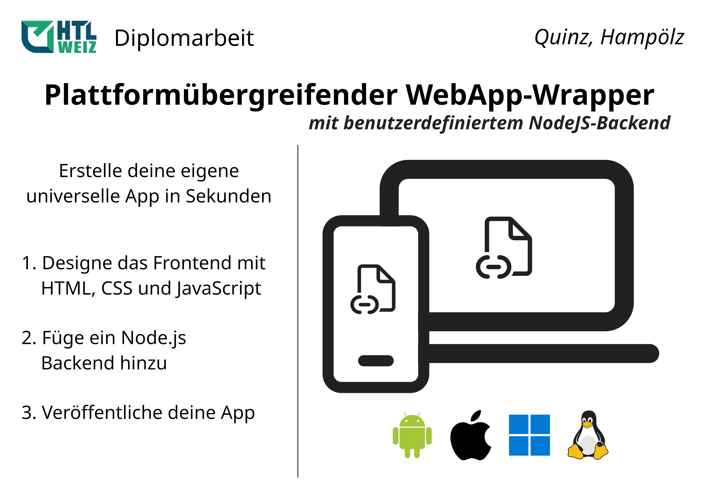

# HTL Diplomarbeit

🎓 Plattformübergreifender WebApp-Wrapper mit benutzerdefiniertem Node.js-Backend

## Kurzfassung

In dieser Diplomarbeit wird ein WebApp-Wrapper entwickelt, der für alle gängigen Plattformen (Windows, Linux, macOS, Android und iOS) kompiliert werden kann. Der WebApp-Wrapper ermöglicht es, Webseiten als Anwendungen auszuführen sowie ein Node.js Projekt einzubinden, um den Funktionsumfang der Anwendung zu erweitern.

Um dies zu erreichen, werden zwei Erweiterungen für das Capacitor-Framework entwickelt:

- **Capacitor-NodeJS:** Diese Erweiterung ermöglicht das Einbinden eines Node.js Projekts in Capacitor-Anwendungen.
- **Capacitor-BrowserView:** Diese Erweiterung ermöglicht das Anzeigen externer Webinhalte in Capacitor-Anwendungen.

Mit den beiden Erweiterungen kann schließlich der WebApp-Wrapper erfolgreich realisiert werden.

## Abstract

In this diploma thesis, a WebApp wrapper is developed that can be compiled for all common platforms (Windows, Linux, macOS, Android and iOS). The WebApp wrapper allows to run web pages as applications and to include a Node.js project to extend the functionality of the application.

To achieve this, two extensions for the Capacitor framework are developed:

- **Capacitor-NodeJS:** This extension allows to include a Node.js project in Capacitor applications.
- **Capacitor-BrowserView:** This extension allows displaying external web content in Capacitor applications.

Finally, with the two extensions, the WebApp wrapper can be successfully implemented.

---

## Verknüpfte Repositories

**Informatives**
- [Lastenheft](https://github.com/hampoelz/HTL_Diplomarbeit_Lastenheft)
- [Dokumentation](https://github.com/hampoelz/HTL_Diplomarbeit_Dokumentation)

**Unterprojekte**
- [Capacitor-NodeJS](https://github.com/hampoelz/Capacitor-NodeJS)
- [Capacitor-BrowserView](https://github.com/hampoelz/Capacitor-BrowserView)
- [WebApp-Wrapper](https://github.com/hampoelz/WebApp-Wrapper)

---

## Ausgangslage:

Mit dem Framework Electron werden Programme für Desktop-Systeme mit Webtechnologien (Frontend) und Node.js (Backend) entwickelt. Mobile-Systeme werden nicht unterstützt. Durch das Capacitor-Framework werden Mobile-Anwendungen mit Webtechnologien entwickelt, jedoch fehlt dort das Node.js Backend. Somit können keine Anwendungen mit Webtechnologien und Node.js vollständig plattformübergreifend entwickelt werden.

## Projektteam (Arbeitsaufwand)

| **Name** | **Individuelle Themenstellung** | **Klasse** | **Arbeitsaufwand** |
|------|-----------------------------|--------|----------------|
| Rene Hampölz (Hauptverantwortlich) | `Capacitor-NodeJS` und `Capacitor-BrowserView` | 5BHET | 180 Stunden |
| Noah Quinz | `WebApp-Wrapper` | 5BHET | 180 Stunden |

## Untersuchungsanliegen der individuellen Themenstellungen

1. **Capacitor-NodeJS**
   * Integration des Projekts `nodejs-mobile` in das Capacitor-Framework (um ein Node.js Backend in Android und iOS zu ermöglichen)
   * Integration in das Projekt `capacitor-community/electron` (um das selbe Node.js Backend in Windows, macOS und Linux zu verwenden)
   * Erstellung einer API zwischen Frontend und Backend
2. **Capacitor-BrowserView**
   * ​​Portierung der BrowserView Funktion von Electron zu Capacitor (für iOS und Android)
   * Integration in das Projekt `capacitor-community/electron` (für  Windows, macOS und Linux)
3. **WebApp-Wrapper**
   * ​​Entwicklung eines Grundgerüsts mit Electron, Capacitor und den Erweiterungen Capacitor-NodeJS und Capacitor-BrowserView
   * Integration weiterer Funktionen (UI, API, etc.)

## Zielsetzung

Webentwickler sollen ohne Erfahrung über native Anwendungen, aus ihrer WebApp bzw. Website, eine plattformübergreifende Anwendung erstellen können. Um die Anwendung mit zusätzlichen Funktionen zu erweitern, kann ein Node.js Backend hinzugefügt werden. Die Anwendung enthält Out-Of-The-Box eine minimale und moderne Benutzeroberfläche sowie eine API, um die geladene Webseite zu steuern, die Benutzeroberfläche anzupassen und um zwischen Frontend und Backend zu kommunizieren.

## Geplantes Ergebnis der individuellen Themenstellungen:

1. **Capacitor-NodeJS**: Das Capacitor-Framework wird um ein Node.js Backend erweitert.
2. **Capacitor-BrowserView**: Die BrowserView Funktion von Electron wird zu Capacitor portiert.
3. **WebApp-Wrapper**: Mithilfe der beiden Capacitor-Erweiterungen und der Integration in die Electron-Plattform für das Capacitor-Framework, wird ein plattformübergreifender WebApp-Wrapper realisiert.

Meilensteine:

* [x] [Capacitor-NodeJS] Android Integration
* [ ] ~[Capacitor-NodeJS] iOS Integration~
* [x] [Capacitor-NodeJS] Electron Integration
* [x] [Capacitor-BrowserView] Android Portierung
* [ ] ~[Capacitor-BrowserView] iOS Portierung~
* [x] [Capacitor-BrowserView] Electron Integration
* [x] [WebApp-Wrapper] Grundgerüst
* [x] [WebApp-Wrapper] Benutzeroberfläche
* [x] [WebApp-Wrapper] WebApp-Wrapper API

> [!NOTE]  
> Die offizielle Entwicklungsumgebung für iOS, Xcode, ist ausschließlich für macOS verfügbar.
> Da während der Entwicklung nur Windows- und Linux Geräte zur Verfügung standen,
> war das Implementieren und Testen der Capacitor-Erweiterungen für iOS nicht möglich.

---

  Made with ❤️ by Rene Hampölz
    
  
  
  

